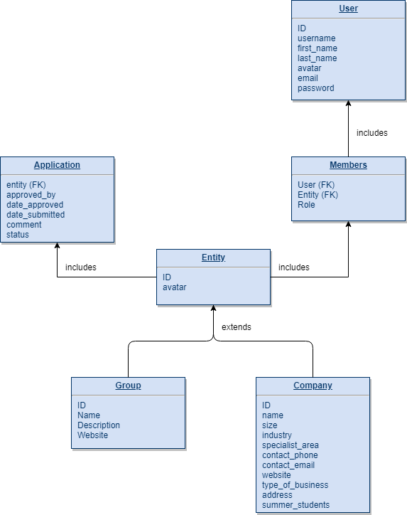

The model includes an entity abstraction model. This Entity model is used by both Company and Group models. In the picture below, 'Groups' is 'Entity' and 'Interest Groups' is 'Group'. Events will branch from 'Entity'.

Company & Group extends the Entity model.

